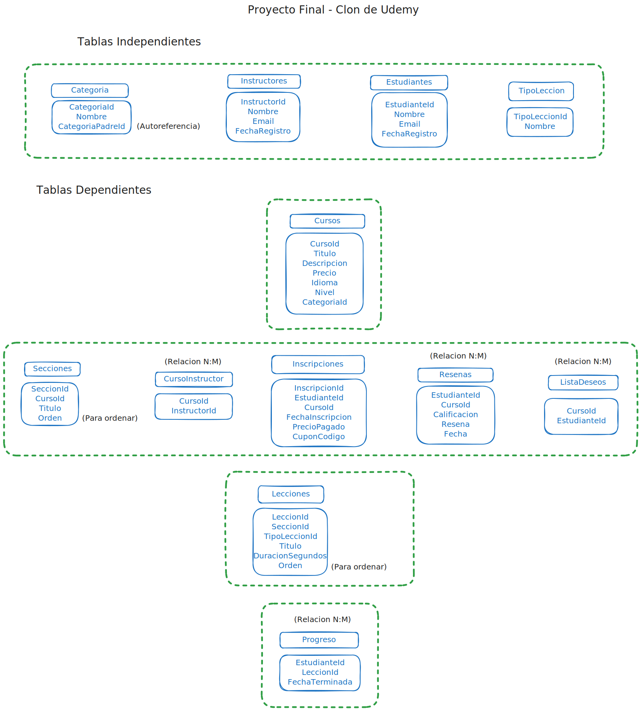

# 📚 Proyecto - Base de Datos: Plataforma tipo Udemy

<p align="center">
  
  
  
</p>

## 📌 Descripción
Este proyecto consiste en el diseño y desarrollo de una base de datos relacional para una plataforma de cursos tipo Udemy.  

Abarca desde la conceptualización del modelo de datos hasta la codificación en SQL Server: definición de entidades, relaciones, restricciones y lógica de negocio.  

La base de datos permite gestionar cursos, instructores y estudiantes, así como funcionalidades clave como inscripciones, progreso de aprendizaje, calificaciones y organización del contenido educativo.

## 👥 Equipo
<p align="center">
  <a href="https://github.com/SalinasCEdison">
    
  </a>
  &nbsp;&nbsp;
  <a href="https://github.com/jennyvaque01-spec">
    
  </a>
</p>

- **Jenny Vaque** – Análisis y diseño del diagrama, responsable del script DDL y de los ejercicios del 1 al 5.
- **Edison Salinas** – Análisis y diseño del diagrama, responsable del script DML y de los ejercicios del 6 al 10.  

## 🎯 Objetivos
- Diseñar una base de datos desde cero.  
- Identificar entidades, atributos y relaciones.  
- Aplicar constraints y reglas de negocio.  
- Construir consultas SQL que respondan a escenarios reales.

## 🧠 Contexto del Negocio
- Cursos online con secciones y lecciones.  
- Inscripciones gratuitas o pagadas.  
- Seguimiento de progreso y calificaciones.  
- Listas de deseos y categorías de cursos.

## 🔗 Diagrama de Entidades
<p align="center">
  
</p>

> \[!NOTE]
> Se muestra la representación visual de la base de datos, permitiendo identificar claramente las entidades, sus atributos y anotaciones claves. [Ver Diagrama en Excalidraw](https://excalidraw.com/#room=dd4605aba25230f90df6,30xbsPcO0cn59QCs0wY1Fw)

## 👥 Actores
<div align="center">

| Actor       | Función |
|------------|------------|
| **Estudiante** | Se inscribe, ve contenido, deja reseñas y calificaciones, sigue su progreso. |
| **Instructor** | Crea cursos, administra contenido, puede colaborar en varios cursos. |
| **Curso**      | Contiene secciones y lecciones, tiene precio, categoría, idioma y nivel de dificultad. |

</div>

## ⚙️ Funcionalidades
- Cursos con múltiples instructores.  
- Jerarquía: Curso → Sección → Lección.  
- Registro de inscripción y precio pagado.  
- Seguimiento del progreso por lección.  
- Calificaciones y reseñas.  
- Lista de deseos.  
- Organización por categorías y subcategorías.

## 📏 Reglas de negocio
- Un estudiante no puede inscribirse dos veces en el mismo curso.  
- Calificación: 1 a 5.  
- Un estudiante solo puede calificar un curso una vez.  
- Cada lección pertenece a una sección y cada sección a un curso.  
- Orden de secciones y lecciones debe preservarse.  
- Curso debe tener al menos un instructor.  
- Progreso = lecciones completadas / total de lecciones.

## 📝 Consultas principales
1. Cursos con calificación promedio y total de reseñas.  
2. Progreso de un estudiante en todos sus cursos inscritos.  
3. Top 5 instructores por número de estudiantes inscritos.  
4. Cursos inscritos pero no iniciados.  
5. Ingresos totales por curso.  
6. Lecciones de un curso con sección y duración.  
7. Estudiantes que completaron 100% de un curso.  
8. Cursos en lista de deseos sin comprar.  
9. Duración total de cada curso.  
10. Cursos por categoría con precio promedio.

## 💻 Scripts y datos

### 🗃 Script DDL

```sql
-- ========================================
-- TABLA: Categoria
-- ========================================
CREATE TABLE Categoria (
    CategoriaId UNIQUEIDENTIFIER PRIMARY KEY DEFAULT NEWID(),
    Nombre NVARCHAR(100) NOT NULL,
    CategoriaPadreId UNIQUEIDENTIFIER NULL, -- FK a sí misma para subcategorías (autoreferencia)
    CONSTRAINT FK_Categoria_Padre FOREIGN KEY (CategoriaPadreId) REFERENCES Categoria(CategoriaId)
);
GO
-- ========================================
-- TABLA: Instructores
-- ========================================
CREATE TABLE Instructores (
    InstructorId UNIQUEIDENTIFIER PRIMARY KEY DEFAULT NEWID(),
    Nombre NVARCHAR(100) NOT NULL,
    Email NVARCHAR(100) UNIQUE NOT NULL,
    FechaRegistro DATETIME2 NOT NULL DEFAULT SYSUTCDATETIME()
);
GO
...
```
> \[!NOTE]
> Se define la estructura completa de la base de datos, incluyendo tablas, relaciones, claves primarias y foráneas, así como restricciones que garantizan la integridad y consistencia de los datos. [Ver Script DDL](./Proyecto-Udemy-DDL.sql)

### 🥫 Script DML

```sql  
-- ========================================
-- INSERT: Categorías con autoreferencia
-- ========================================
DECLARE 
    @CatProgramacion UNIQUEIDENTIFIER = NEWID(),
    @CatWeb UNIQUEIDENTIFIER = NEWID(),
    @CatBD UNIQUEIDENTIFIER = NEWID(),
    @CatSeguridad UNIQUEIDENTIFIER = NEWID(),
    @CatIA UNIQUEIDENTIFIER = NEWID(),
    @CatFrontend UNIQUEIDENTIFIER = NEWID(),
    @CatBackend UNIQUEIDENTIFIER = NEWID();

INSERT INTO Categoria (CategoriaId, Nombre, CategoriaPadreId)
VALUES
    (@CatProgramacion, 'Programación', NULL),
    (@CatWeb, 'Desarrollo Web', @CatProgramacion),
    (@CatBD, 'Bases de Datos', @CatProgramacion),
    (@CatSeguridad, 'Seguridad Informática', @CatProgramacion),
    (@CatIA, 'Inteligencia Artificial', @CatProgramacion),
    (@CatFrontend, 'Frontend', @CatWeb),
    (@CatBackend, 'Backend', @CatWeb);
...
```
> \[!NOTE]
> Se insertan datos de prueba representativos del negocio, permitiendo simular escenarios reales y validar el correcto funcionamiento de la base de datos y sus relaciones. [Ver Script DML](./Proyecto-Udemy-DML.sql)

### 🔍 Script de Consultas</h4>
  
```sql    
-- ========================================
-- 1. Cursos con su calificación promedio y número de reseñas
-- ========================================
SELECT 
    c.Titulo, 
    ROUND(AVG(CAST(r.Calificacion AS FLOAT)), 2) AS PromedioCalificacion,
    COUNT(r.EstudianteId) AS TotalResenas
FROM Cursos c
LEFT JOIN Resenas r ON c.CursoId = r.CursoId
GROUP BY c.Titulo
ORDER BY PromedioCalificacion DESC;
GO
...
```
> \[!NOTE]
> Se desarrollan consultas para poner a prueba diferentes operaciones y relaciones entre tablas. [Ver Script de consultas](./Proyecto-Udemy-Ejercicios.sql).
